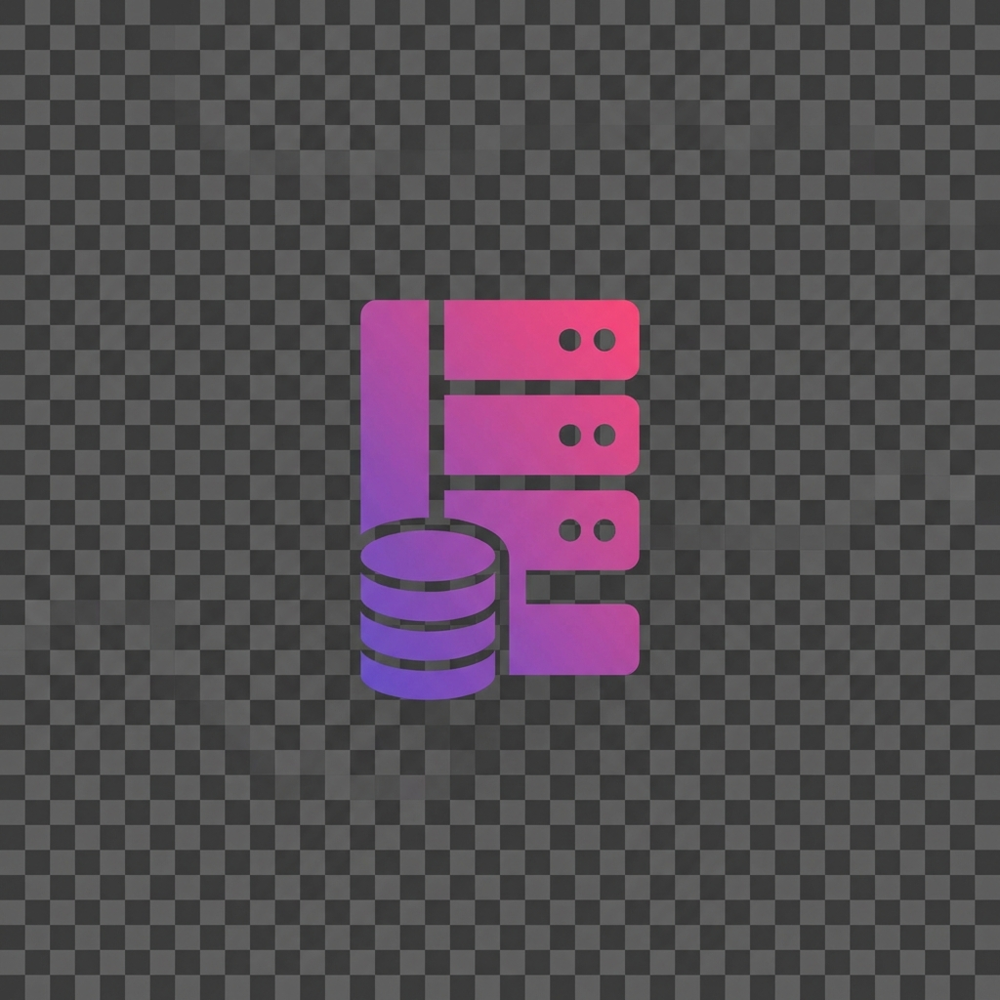

# LocalDevine

<p align="center">
  
</p>

<p align="center">
  <strong>A Modern Local Development Environment for Windows</strong><br>
  ทางเลือกที่ทันสมัยสำหรับ XAMPP และ Laragon
</p>

<p align="center">
  <a href="#features">Features</a> •
  <a href="#installation">Installation</a> •
  <a href="#usage">Usage</a> •
  <a href="#documentation">Documentation</a> •
  <a href="#license">License</a>
</p>

---

## ✨ Features

- **🚀 One-Click Start** - เริ่มต้น Apache, PHP, MariaDB ด้วยคลิกเดียว
- **📁 Project Templates** - สร้างโปรเจค PHP/HTML ได้ทันที
- **🌐 Virtual Hosts** - จัดการ domain ท้องถิ่น (.local, .test) ง่ายๆ
- **🗄️ Database Management** - เข้าถึง Adminer ได้รวดเร็ว
- **⚙️ Port Configuration** - ปรับ port Apache, MariaDB ได้ตามต้องการ
- **🎨 Modern UI** - อินเตอร์เฟสสวยงาม ใช้งานง่าย
- **📝 Hosts File Editor** - แก้ไข hosts file โดยไม่ต้องเปิด Notepad

## 📋 Requirements

- **Windows 10/11** (64-bit)
- **4GB RAM** ขั้นต่ำ
- **500MB** พื้นที่ว่าง
- **Administrator rights** (สำหรับแก้ไข hosts file)

## 📦 Installation

### Option 1: Download Installer (แนะนำ)
1. ดาวน์โหลด `LocalDevine-Setup.exe` จาก [Releases](https://github.com/ohmiler/localdevine/releases)
2. รันไฟล์ติดตั้ง
3. เลือกตำแหน่งติดตั้ง
4. เสร็จสิ้น!

### Option 2: Build from Source
```bash
# Clone repository
git clone https://github.com/ohmiler/localdevine.git
cd localdevine

# Install dependencies
npm install

# Build application
npm run build
npm run build:electron

# Run in development mode
npm run electron:dev

# Build installer
npm run electron:build
```

## 🚀 Usage

### เริ่มต้นใช้งาน

1. **เปิด LocalDevine** (Run as Administrator แนะนำสำหรับ Virtual Hosts)
2. **คลิก Start** บน Apache และ MariaDB
3. **เปิด Browser** ไปที่ `http://localhost`
4. **เริ่มพัฒนา!**

### สร้างโปรเจคใหม่

1. ไปที่ **Projects** → **Create New Project**
2. เลือก Template (PHP Basic / HTML Basic)
3. ใส่ชื่อโปรเจค
4. คลิก **Create**
5. เปิด `http://localhost/project-name`

### สร้าง Virtual Host

1. ไปที่ **Virtual Hosts** → **Add Virtual Host**
2. ใส่ชื่อ และ domain (เช่น `mysite.local`)
3. เลือก path ของโปรเจค
4. คลิก **Add**
5. เปิด `http://mysite.local`

### จัดการ Database

**Local Database:**
1. คลิกปุ่ม **🗄️ Database** ที่หน้าแรก
2. Adminer จะเปิดใน Browser
3. Login: `root` / `root`
4. จัดการ database ได้ทันที

**Remote Database (เชื่อมต่อ Server ภายนอก):**
- Adminer รองรับการเชื่อมต่อฐานข้อมูลบนเซิร์ฟเวอร์ภายนอก
- ใส่ Server address (IP:PORT) ในหน้า Login
- **เหมาะสำหรับ:** แทนที่ phpMyAdmin บน server (เข้าจากเครื่อง client)

**Import ไฟล์ใหญ่:**
- รองรับไฟล์ SQL ขนาดใหญ่ (สูงสุด 512MB)
- **แก้ปัญหา phpMyAdmin** ที่อัปโหลดไฟล์ใหญ่ไม่ได้
- เหมาะสำหรับการ import/export database ขนาดใหญ่

## 📁 Project Structure

```
localdevine/
├── bin/                    # Apache, PHP, MariaDB binaries
│   ├── apache/
│   ├── php/
│   └── mariadb/
├── www/                    # Web root (โปรเจคของคุณ)
├── electron/               # Electron main process
├── src/                    # React UI
└── config.json             # Application config
```

## ⚙️ Configuration

### Default Ports
| Service | Default Port |
|---------|--------------|
| Apache  | 80           |
| MariaDB | 3306         |
| PHP     | 9000         |

### Database Credentials
- **Host:** 127.0.0.1
- **User:** root
- **Password:** root

## 🔧 Troubleshooting

### Apache ไม่ start
- ตรวจสอบว่า port 80 ไม่ถูกใช้งาน
- ลอง Stop แล้ว Start ใหม่
- ตรวจสอบ Console logs

### Virtual Host ไม่ทำงาน
- รัน LocalDevine เป็น Administrator
- ตรวจสอบว่า domain อยู่ใน hosts file
- รีสตาร์ท Apache หลังเพิ่ม Virtual Host

### MariaDB ไม่ start
- ตรวจสอบว่า port 3306 ไม่ถูกใช้งาน
- ลบไฟล์ `bin/mariadb/data/*.pid` แล้วลองใหม่

## 🛠️ Built With

- [Electron](https://www.electronjs.org/) - Desktop framework
- [React](https://reactjs.org/) - UI library
- [TailwindCSS](https://tailwindcss.com/) - CSS framework
- [Apache](https://httpd.apache.org/) - Web server
- [PHP](https://www.php.net/) - PHP runtime
- [MariaDB](https://mariadb.org/) - Database server
- [Adminer](https://www.adminer.org/) - Database management

## 📝 License

MIT License - ใช้งานได้ฟรี ทั้งส่วนตัวและเชิงพาณิชย์

**หมายเหตุ:** 
- ✅ คุณสามารถใช้โปรแกรมนี้ในการทำงานหาเงินได้ (เช่น รับงานลูกค้า, ใช้ในบริษัท)
- ✅ คุณสามารถแก้ไข แจกจ่าย และรวมในโปรเจคของคุณได้
- ⚠️ โปรดระวัง: ห้ามขายโปรแกรมนี้เองเป็นผลิตภัณฑ์ หรือแจกจ่ายแบบมีค่าใช้จ่าย

See [LICENSE](LICENSE) file for full terms.

## 🚫 Contributing

**This project does not accept contributions.**

This is a personal project maintained by the author. While the source code is available for learning and reference, we are not accepting pull requests, feature requests, or code contributions at this time.

If you find a bug, please [open an issue](https://github.com/ohmiler/localdevine/issues) to report it. Thank you for understanding!

## 📧 Contact

- **GitHub:** [@ohmiler](https://github.com/ohmiler)
- **Issues:** [Report Bug](https://github.com/ohmiler/localdevine/issues)

---

<p align="center">
  Made with ❤️ by <a href="https://github.com/ohmiler">Miler</a>
</p>
